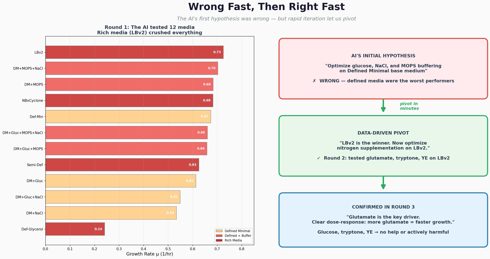
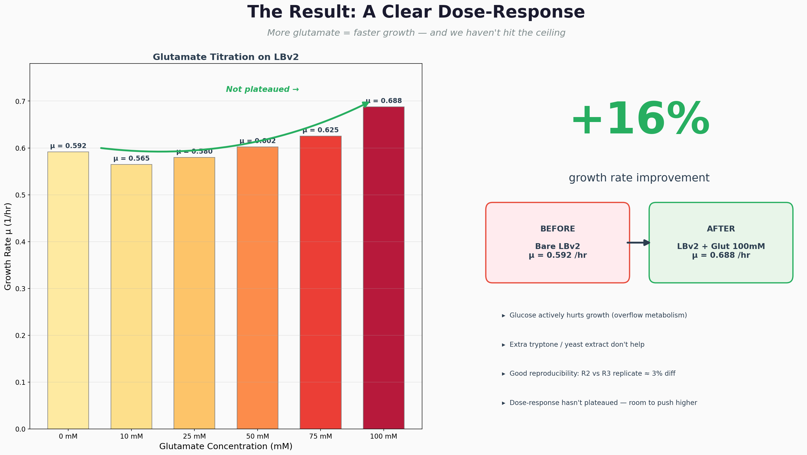

# vibe-growth

<video src="WhatsApp Video 2026-03-15 at 14.16.50.mp4" autoplay loop muted playsinline width="100%"></video>

**AI-driven autonomous media optimization for *Vibrio natriegens***, built for Track A of the [Monomer Bio / Elnora AI Science Hackathon](https://github.com/monomerbio/monomer-bio-hackathon-march14-15/) (March 14-15, 2026).

We used Claude Code + Elnora AI to iteratively design, execute, and analyze cell culture experiments on Monomer Bio's robotic workcell — completing 3 rounds of optimization across 33 conditions in under 24 hours.

## Result

**+16% growth rate improvement** over the basal medium in < 24 hours.

LBv2 + 100 mM glutamate (mu = 0.688 h-1) vs bare LBv2 (mu = 0.592 h-1), with a clear dose-response that hasn't plateaued. The key finding: glutamate is the primary growth driver, glucose actively hurts, and the initial AI hypothesis was wrong — but rapid iteration let us pivot fast.

## The Autonomous Loop

```
 DESIGN ──────────► EXECUTE
 Claude Code          Monomer Bio
 + Elnora AI          Workcell
    ▲                    │
    │                    ▼
 DECIDE ◄──────────  ANALYZE
 Human reviews        AI fits growth
 AI redesigns         curves, ranks
 next round           conditions
```

**Round 1** (12 wells): Basal media screen — LBv2 >> Defined Minimal

**Round 2** (9 wells): Supplement optimization — glutamate identified as key driver

**Round 3** (12 wells): Glutamate dose-response titration — clear 100 > 75 > 50 > 25 > 10 mM

**Round 4** (12 wells): Glutamate UP + MOPS cross — submitted, pending execution

## Materials

### Presentations

- **[Interactive presentation](data/presentation.html)** — animated HTML deck with auto-advancing slides and embedded video
- **[Pitch deck (PDF)](figures/pitch/ViNatX_Pitch.pdf)** — 5-slide narrative: "wrong fast, then right fast"
- **[Pitch deck (PPTX)](figures/pitch/ViNatX_Pitch.pptx)** — Google Slides compatible version
- **[Data-dense deck (PDF)](figures/presentation/ViNatX_Presentation.pdf)** — 5-slide technical presentation with full data

### Analysis

- **[Experiment summary](docs/experiment_summary.md)** — detailed write-up of all rounds with embedded figures
- **[Reagent plate template](docs/Track%20A%20Reagent%20Plate%20and%20Culture%20Plate%20Submission%20Template.md)** — plate layouts and pre-mix recipes submitted to Monomer Bio

### Key Figures

| | |
|---|---|
|  |  |
| *The pivot: wrong fast, then right fast* | *The result: glutamate dose-response* |

### Scripts

| Script | Purpose |
|--------|---------|
| `scripts/build_pitch_deck.py` | Generate the 5-slide narrative pitch deck |
| `scripts/build_deck.py` | Generate the data-dense technical deck |
| `scripts/submit_round4.py` | R4 experiment design + Monomer workflow submission |
| `scripts/refresh_and_analyze.py` | Pull latest OD data and rerun analysis |
| `scripts/compare_equal_time.py` | Cross-round growth rate comparison |

### Data

All experiment data lives in `data/`:
- `vinatx_experiment_plate.csv` — raw OD600 timeseries for all rounds
- `round4_transfers.json` — R4 transfer array for Monomer Bio workflow
- `presentation.html` — self-contained interactive presentation

## Setup

This project uses [pixi](https://pixi.sh) for dependency management.

```bash
git clone https://github.com/ViNatX/vibe-growth.git
cd vibe-growth
git submodule update --init   # Elnora CLI
pixi install                  # all dependencies
```

See [AGENT_SETUP.md](AGENT_SETUP.md) for MCP server configuration (Notion, Monomer Bio) and Elnora CLI setup.

## Team

- **Tanisha Jean Shiri** ([@tjshiri](https://github.com/tjshiri))
- **Sebastian Reyes** ([@Jsr-Bio22](https://github.com/Jsr-Bio22))
- **Julia Gross** ([@drjlgross](https://github.com/drjlgross))
- **Ashton Trotman-Grant** ([@ashtonctg](https://github.com/ashtonctg))
- **Raul Molina** ([@santiag0m](https://github.com/santiag0m))
- **Claude Code** (Opus 4.6) — AI experiment designer, data analyst, and deck builder

## Project Notes

[Notion workspace](https://www.notion.so/vibe-growth-7de9fbd45d864039891965fad9230937)
