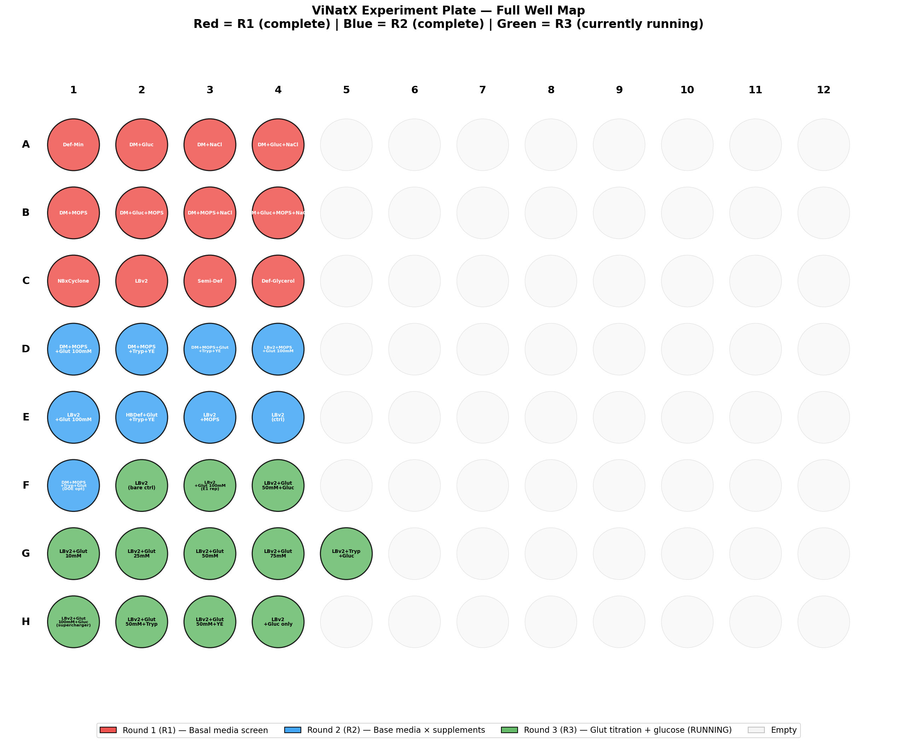
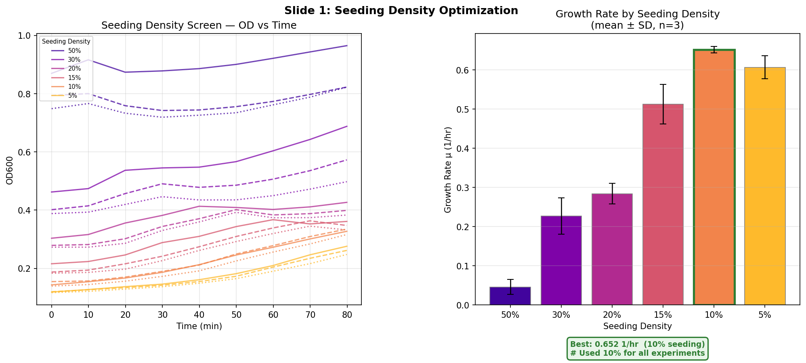
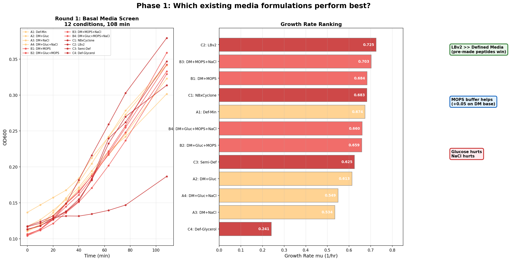
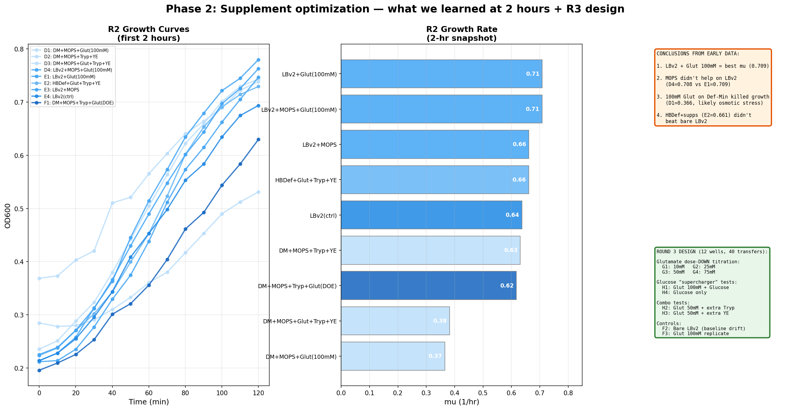
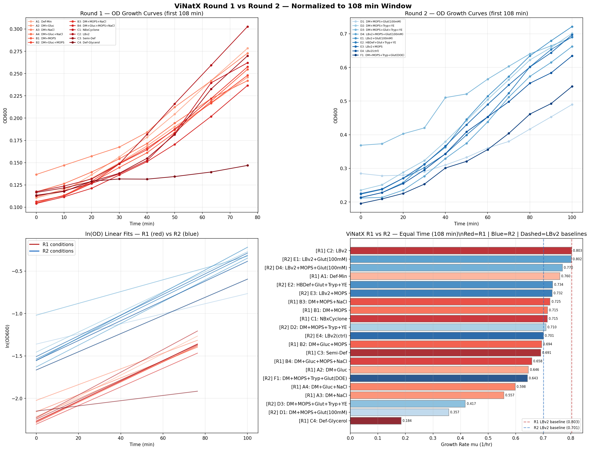
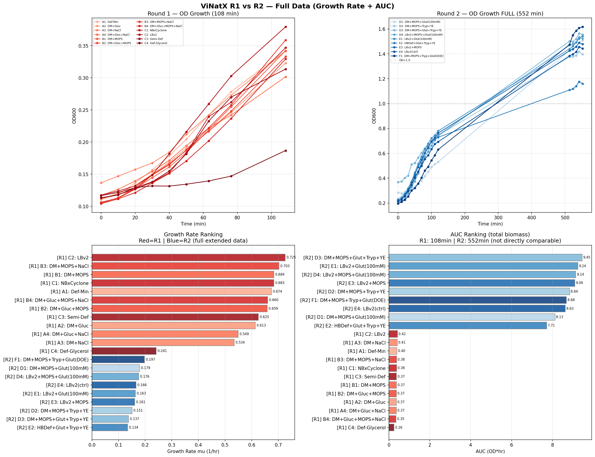
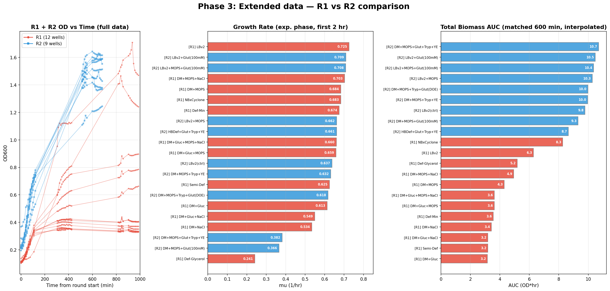
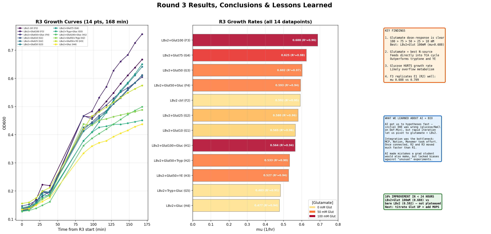

# ViNatX Experiment Summary

**Team ViNatX** — Monomer Bio / Elnora AI Science Hackathon, Track A
**Organism:** *Vibrio natriegens*
**Goal:** Iteratively optimize growth media composition using an autonomous experiment loop on a robotic workcell

---

## Autonomous Experiment Loop

Each round follows the same cycle:

1. **Design** — AI agent proposes media formulations based on prior results
2. **Execute** — Monomer Bio workcell performs liquid transfers + OD600 reads
3. **Analyze** — Growth rates, AUC, and response surface models computed automatically
4. **Iterate** — Next round informed by data + scientific review (Elnora AI)

All experiments use 96-well plates (200 uL/well: 180 uL media + 20 uL inoculum, 10% seeding density).

### Full Plate Map (3 Rounds)

---

## Round 0: Seeding Density Optimization

**Objective:** Determine optimal inoculum volume for *V. natriegens* growth in 200 uL microplate wells.

**Design:** 6 seeding densities (5%, 10%, 15%, 20%, 30%, 50%) with 3 biological replicates each, all in NBxCyclone media. 18 wells total on the ViNatX Tutorial Experiment Plate.

**Key Result:** 10% inoculum (20 uL) gave the highest growth rate (mu = 0.652 1/hr, mean of 3 replicates). Higher densities (30-50%) started at higher OD but grew much slower — likely due to immediate oxygen depletion and nutrient competition.

**Decision:** All subsequent experiments use **10% inoculum (20 uL)**.

---

## Round 1: Basal Media Screen

**Objective:** Compare 4 pre-mixed base media and test individual supplement effects (MOPS, Glucose, NaCl) on Defined-Minimal base.

**Design:** 12 conditions in wells A1-C4:

| Wells | Base Media | Supplements |
|-------|-----------|-------------|
| A1-A4 | Defined-Minimal | None / +Gluc / +NaCl / +Gluc+NaCl |
| B1-B4 | Defined-Minimal | +MOPS / +Gluc+MOPS / +MOPS+NaCl / +Gluc+MOPS+NaCl |
| C1 | NBxCyclone | None (control) |
| C2 | LBv2 | None |
| C3 | Semi-Defined | None |
| C4 | Defined-Glycerol | None |

**Duration:** 108 min, 9 timepoints.

**Key Results (growth rate, mu 1/hr):**

| Rank | Condition | mu | Insight |
|------|-----------|-----|---------|
| 1 | C2: LBv2 | 0.725 | Rich media wins — pre-made peptides enable fast growth |
| 2 | B3: DM+MOPS+NaCl | 0.703 | MOPS buffering helps defined media |
| 3 | B1: DM+MOPS | 0.684 | MOPS alone is nearly as good |
| ... | | | |
| 11 | A3: DM+NaCl | 0.534 | NaCl alone hurts growth |
| 12 | C4: Def-Glycerol | 0.241 | Glycerol is a poor carbon source |

**Takeaways:**
- **LBv2 is the best base** — its pre-mixed tryptone + yeast extract provide immediately usable nitrogen
- **Glucose hurts** — consistently lowered growth rate across all DM combinations
- **NaCl hurts** — additional salt is detrimental
- **MOPS helps** — pH buffering improves growth on defined media

---

## Round 2: Supplement Optimization Across Base Media

**Objective:** Test glutamate, tryptone, and yeast extract as supplements across 3 base media (Defined-Minimal, LBv2, HBDef). Informed by CellAI's finding that HBDef + Tryp + YE + Glutamate gave their best result (mu = 0.808).

**Design:** 9 conditions in wells D1-F1:

| Well | Base | Supplements | Rationale |
|------|------|------------|-----------|
| D1 | Def-Min | MOPS 20 + Glut 20 (100mM) | High glutamate on defined base |
| D2 | Def-Min | MOPS 20 + Tryp 20 + YE 20 | Complex nitrogen on defined base |
| D3 | Def-Min | MOPS 20 + Glut 10 + Tryp 20 + YE 10 | Full combo |
| D4 | LBv2 | MOPS 20 + Glut 20 (100mM) | Glutamate + buffer on rich base |
| E1 | LBv2 | Glut 20 (100mM) | Glutamate only on rich base |
| E2 | HBDef | Glut 10 + Tryp 20 + YE 20 | CellAI B5-like formula |
| E3 | LBv2 | MOPS 20 | Buffer only on rich base |
| E4 | LBv2 | None | LBv2 bare control |
| F1 | Def-Min | MOPS 10 + Tryp 26 + Glut 10 | DOE model optimum |

**Duration:** 120 min initial OD reads, then continued monitoring during R3 (total ~9 hrs).

**Stock Concentrations:** Glutamate = 1M Na L-Glutamate; Tryptone = 100 mg/mL; Yeast Extract = 100 mg/mL; MOPS = 400 mM pH 7.0.

### Two-Phase Discovery

The 2-hour snapshot told one story. The extended 9-hour data told a completely different one.

**Early snapshot (first 2 hours) — growth rate ranking:**

| Rank | Well | Condition | mu (1/hr) | Pattern |
|------|------|-----------|-----------|---------|
| 1 | E1 | LBv2+Glut(100mM) | 0.709 | Fast exponential |
| 2 | D4 | LBv2+MOPS+Glut(100mM) | 0.708 | Fast exponential |
| 3 | E3 | LBv2+MOPS | 0.662 | Moderate growth |
| ... | | | | |
| 8 | D3 | DM+MOPS+Glut+Tryp+YE | 0.382 | Appeared stalled |
| 9 | D1 | DM+MOPS+Glut(100mM) | 0.366 | Appeared inhibited |

**Extended data (9+ hours) — max OD ranking:**

| Rank | Well | Condition | Max OD | Growth pattern |
|------|------|-----------|--------|----------------|
| 1 | **F1** | DM+MOPS+Tryp+Glut(DOE) | **1.618** | Long lag, then highest OD |
| 2 | D3 | DM+MOPS+Glut+Tryp+YE | 1.564 | Long lag, big recovery |
| 3 | E1 | LBv2+Glut(100mM) | 1.544 | Fast start, kept growing |
| 4 | D4 | LBv2+MOPS+Glut(100mM) | 1.535 | Fast start, kept growing |
| 5 | D1 | DM+MOPS+Glut(100mM) | 1.507 | Recovered from "inhibition" |

The wells we thought were failures (D1, D3, F1) had **extended lag phases** but ultimately reached the **highest biomass**.

### Two Growth Classes

The data revealed two fundamentally different metabolic strategies:

**Class 1: Fast Starters (LBv2-based)**
- E1, D4, E3, E4 — growth rate mu > 0.63 in first 2 hours
- LBv2 provides pre-made peptides and amino acids for immediate growth
- Plateau at OD ~1.4-1.5 when complex nutrients exhaust and fermentation acids crash pH
- No MOPS buffer → pH drops below viable range

**Class 2: Lag-then-Explode (DM-based with MOPS)**
- F1, D3, D1 — slow start (mu < 0.4 in first 2 hours), then rapid growth to OD > 1.5
- Defined-Minimal base contains 40 mM MOPS; supplemental MOPS adds 20-40 mM more
- Total buffering capacity of 60-80 mM neutralizes fermentation acids
- Cells need time to build biosynthetic machinery, but once established, grow sustainably

**The key insight: the aerobic-to-anaerobic transition determines maximum biomass.** In sealed 200 uL wells, dissolved oxygen is consumed within 30-40 minutes. After that, cells switch to fermentation, producing organic acids (acetate, formate, lactate) that acidify the medium. Without sufficient pH buffering (MOPS), growth stops at OD ~1.4. With strong buffering, cells continue to OD > 1.6.

### LBv2 Baseline Drift Between Rounds

Bare LBv2 gave mu = 0.803 in Round 1 but only 0.701 in Round 2 (13% drop). This is likely due to different inoculum age or cell stock density between rounds, highlighting the need for internal controls in every round.

---

## ViNatX vs CellAI Comparison

All conditions from both teams ranked using an equal 108-minute time window for fair comparison.

**Top 5 (108-min matched window):**

| Rank | Team | Condition | mu (1/hr) |
|------|------|-----------|-----------|
| 1 | CellAI R1 | HBDef+Tryp+YE+Glut (B5) | 0.808 |
| 2 | ViNatX R1 | LBv2 (C2) | 0.803 |
| 3 | ViNatX R2 | LBv2+Glut 100mM (E1) | 0.802 |
| 4 | CellAI R1 | HBDef+Tryp+YE+Glut (B6) | 0.789 |
| 5 | CellAI R1 | HBDef+Tryp+YE+Glut (B7) | 0.777 |

**Team averages:** ViNatX 0.648, CellAI 0.652 — essentially tied.

ViNatX achieved comparable growth rates with a **much simpler formulation** (LBv2 + glutamate vs HBDef + 3 supplements). CellAI's R2 conditions mostly fell in the 0.46-0.70 range — their iteration did not improve over R1.

---

## Round 3: Glutamate Dose Titration + Glucose

**Objective:** Titrate glutamate concentration on LBv2 to find the optimal dose, test glucose as an additional carbon source, and include proper controls for baseline drift.

**Design:** 12 conditions in wells F2-H4, 40 transfers (maximum for workcell). Reviewed by Elnora AI before submission.

| Well | Base (uL) | Glut | Other | [Glut] mM | Purpose |
|------|-----------|------|-------|-----------|---------|
| F2 | LBv2 180 | -- | -- | 0 | Bare LBv2 control (R3 baseline) |
| F3 | LBv2 160 | 20 | -- | 100 | E1 replicate (reproducibility) |
| F4 | LBv2 166 | 10 | Gluc 4 | 50 | Glutamate + glucose combo |
| G1 | LBv2 178 | 2 | -- | 10 | Titration: low dose |
| G2 | LBv2 175 | 5 | -- | 25 | Titration: low-mid |
| G3 | LBv2 170 | 10 | -- | 50 | Titration: mid |
| G4 | LBv2 165 | 15 | -- | 75 | Titration: high-mid |
| G5 | LBv2 156 | -- | Tryp 20, Gluc 4 | 0 | Tryp+glucose, no glutamate |
| H1 | LBv2 156 | 20 | Gluc 4 | 100 | Glucose supercharger |
| H2 | LBv2 150 | 10 | Tryp 20 | 50 | Glut + extra tryptone |
| H3 | LBv2 150 | 10 | YE 20 | 50 | Glut + extra yeast extract |
| H4 | LBv2 176 | -- | Gluc 4 | 0 | Glucose only |

**Duration:** 168 min, 14 timepoints per well.

### Results

**Growth rate ranking (all 14 datapoints):**

| Rank | Well | Condition | mu (1/hr) | R² |
|------|------|-----------|-----------|-----|
| 1 | F3 | LBv2+Glut 100mM | 0.688 | 0.96 |
| 2 | G4 | LBv2+Glut 75mM | 0.625 | 0.98 |
| 3 | G3 | LBv2+Glut 50mM | 0.602 | 0.97 |
| 4 | F4 | LBv2+Glut 50mM+Gluc | 0.593 | 0.94 |
| 5 | F2 | LBv2 ctrl | 0.592 | 0.95 |
| 6 | G2 | LBv2+Glut 25mM | 0.580 | 0.96 |
| 7 | G1 | LBv2+Glut 10mM | 0.565 | 0.96 |
| 8 | H1 | LBv2+Glut 100mM+Gluc | 0.564 | 0.94 |
| 9 | H2 | LBv2+Glut 50mM+Tryp | 0.533 | 0.90 |
| 10 | H3 | LBv2+Glut 50mM+YE | 0.527 | 0.94 |
| 11 | G5 | LBv2+Tryp+Gluc | 0.483 | 0.91 |
| 12 | H4 | LBv2+Gluc | 0.477 | 0.94 |

### Key Findings

1. **Clear glutamate dose-response:** Higher [glutamate] = faster growth. The titration series (G1→G4) shows a monotonic increase: 10 mM (0.565) → 25 mM (0.580) → 50 mM (0.602) → 75 mM (0.625) → 100 mM (0.688). Growth rate has **not plateaued** — higher doses should be tested.

2. **Glutamate is the best nitrogen source:** It feeds directly into the TCA cycle via alpha-ketoglutarate, making it easy for *V. natriegens* to metabolize. Tryptone and yeast extract at equivalent volumes performed worse.

3. **Glucose hurts growth rate:** H1 (Glut 100mM + Gluc) at 0.564 was significantly worse than F3 (Glut 100mM alone) at 0.688. H4 (Gluc only) was the worst performer at 0.477. Glucose likely causes overflow metabolism (acetate production) that acidifies the medium.

4. **Extra tryptone/YE don't help:** H2 (Glut 50mM + Tryp) at 0.533 and H3 (Glut 50mM + YE) at 0.527 were both worse than G3 (Glut 50mM alone) at 0.602. Complex nitrogen sources add no value when glutamate is present.

5. **Good reproducibility:** F3 (LBv2+Glut 100mM) replicates E1 from R2: mu = 0.688 vs 0.709 (3% difference across rounds).

---

## Key Insights

### 1. LBv2 is the optimal base for *V. natriegens*
Pre-mixed rich media (10 mg/mL tryptone, 5 mg/mL YE, 375 mM NaCl) provides immediate building blocks for fast growth without lag.

### 2. Glutamate is the best supplement — and dose-response hasn't plateaued
100 mM sodium L-glutamate on LBv2 gives the highest growth rate (mu = 0.688). The R3 titration (10–100 mM) shows a clear monotonic dose-response. Glutamate serves as both C-source (via alpha-ketoglutarate into TCA cycle) and N-source, and is easier to metabolize than tryptone or yeast extract.

### 3. Buffering capacity controls maximum biomass
MOPS buffer (40-80 mM) prevents the anaerobic fermentation acid crash that limits growth in sealed microplate wells. R2 showed that MOPS-buffered wells (DM-based) ultimately reach higher OD than unbuffered wells (LBv2-based), despite slower starts. Over a matched 600-min window with interpolation, R2 MOPS-buffered conditions dominate AUC.

### 4. Glucose hurts — overflow metabolism
Adding glucose consistently lowered growth rates across R1 (DM+Gluc < DM) and R3 (Glut+Gluc < Glut alone). Glucose likely causes overflow metabolism (acetate production) that acidifies the medium faster than MOPS can buffer.

### 5. 2-hour snapshots are misleading
*V. natriegens* needs 6+ hours to reveal its full growth trajectory. Wells that appeared "stalled" or "inhibited" at 2 hours often recovered to become the highest-biomass conditions by 9 hours.

### 6. Simpler is competitive
ViNatX's best condition (LBv2 + glutamate, 2 components) matches CellAI's best (HBDef + Tryp + YE + Glut, 4 components) in growth rate at equal time windows.

---

## Future Direction: Round 4 Hypothesis

R3 confirmed that glutamate dose-response has not plateaued at 100 mM. The next round should:

### 1. Titrate glutamate UP
Test 125, 150, and 200 mM on LBv2. The growth rate may continue to increase before osmotic stress becomes limiting.

### 2. Add MOPS buffer to LBv2 + Glutamate
R2 showed MOPS-buffered wells reached the highest AUC over the full time course. Combining the fast start of LBv2+Glut with MOPS buffering should give both high growth rate AND high total biomass.

### 3. Optimal formulation hypothesis

**LBv2 + Glutamate 150 mM + MOPS 20 uL**

| Component | Role |
|-----------|------|
| LBv2 base | Pre-made peptides for fast aerobic start |
| Glutamate (150 mM) | Sustained C/N source — pushing past 100 mM |
| MOPS buffer (40 mM) | Prevents pH crash from anaerobic fermentation acids |

This combines the best growth rate driver (glutamate) with the best AUC driver (MOPS buffering). Extra tryptone and yeast extract are not needed — R3 showed they add no value when glutamate is present.
